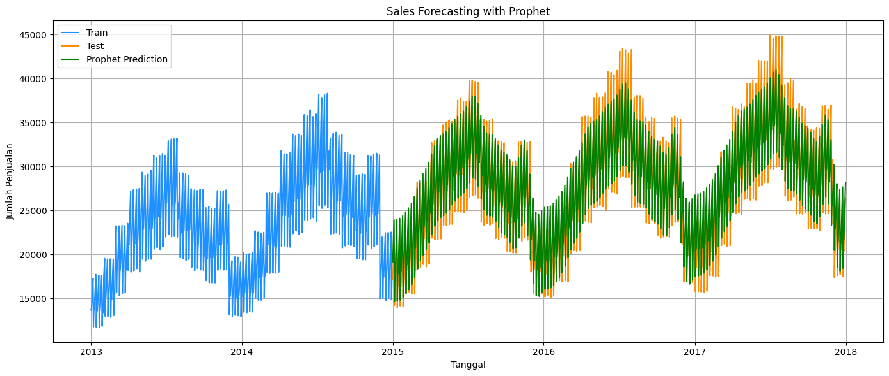

# Laporan Proyek Sales Forecasting - Defrizal Yahdiyan Risyad

## Project Overview

Pada proyek ini, saya bertujuan untuk melakukan **forecasting penjualan** menggunakan model Prophet. Proyek ini bertujuan untuk membantu bisnis dalam memprediksi jumlah penjualan di masa depan, sehingga mereka dapat merencanakan stok dan strategi pemasaran dengan lebih baik.

**Referensi**:
- [A Comparative Study on Forecasting of Retail Sales](https://arxiv.org/abs/2203.06848)

### Rubrik/Kriteria Tambahan (Opsional):
- Proyek ini sangat penting bagi perusahaan dalam mengoptimalkan manajemen inventaris dan mengurangi risiko kekurangan atau kelebihan stok.

## Business Understanding

### Problem Statements
- Bagaimana cara memprediksi jumlah penjualan di masa depan dengan akurat menggunakan data historis?
- Bagaimana meningkatkan perencanaan stok dan strategi pemasaran menggunakan prediksi penjualan?

### Goals
- Mengembangkan model yang dapat memprediksi penjualan masa depan dengan tingkat akurasi yang baik.
- Menggunakan model Prophet untuk menganalisis data historis penjualan dan mengidentifikasi tren serta pola musiman.

### Solution Approach
- Menggunakan **Prophet** untuk melakukan time series forecasting. Prophet adalah model yang dapat menangani data musiman yang kuat dengan komponen tren yang berubah seiring waktu.
- Melakukan **data preprocessing** untuk memastikan data bersih dan siap digunakan dalam model.

## Data Understanding

Dataset yang digunakan dalam proyek ini berisi data penjualan harian. Dataset dapat diunduh di 

**Sumber**: [Store Item Demand Forecasting Challenge](https://www.kaggle.com/competitions/demand-forecasting-kernels-only/overview). Dataset ini memiliki dua kolom utama:

- **date**: Tanggal terjadinya transaksi.
- **sales**: Jumlah unit produk yang terjual pada tanggal tersebut.

Data tersebut mencakup penjualan harian selama beberapa tahun. Data ini dibersihkan terlebih dahulu untuk memastikan tidak ada nilai yang hilang atau duplikat.

### Variabel-variabel pada dataset:
- **date**: Tanggal penjualan terjadi, dalam format YYYY-MM-DD.
- **sales**: Jumlah penjualan yang terjadi pada tanggal tersebut.

## Data Preparation

Tahap persiapan data dilakukan dengan langkah-langkah berikut:
1. **Mengubah kolom 'date' menjadi format datetime** untuk memastikan bahwa model dapat mengenali urutan waktu.
2. **Agregasi penjualan harian** untuk memastikan data penjualan diorganisir dengan benar berdasarkan tanggal.
3. **Splitting data**: Data dibagi menjadi dua bagian, yaitu **training** dan **testing**. Data training digunakan untuk melatih model, sedangkan data testing digunakan untuk menguji prediksi model.

Langkah-langkah tersebut dilakukan untuk mempersiapkan data agar siap digunakan dalam model Prophet.

## Modeling

Model yang digunakan dalam proyek ini adalah **Prophet** yang diinisialisasi dengan parameter sebagai berikut:
- **yearly_seasonality=True**: Menangani pola musiman tahunan.
- **weekly_seasonality=True**: Menangani pola musiman mingguan.
- **daily_seasonality=False**: Tidak menggunakan komponen musiman harian.

Model ini dilatih menggunakan data training dan kemudian digunakan untuk memprediksi penjualan di masa depan dengan menggunakan data testing.

## Evaluation

Evaluasi dilakukan menggunakan dua metrik, yaitu:
1. **Root Mean Squared Error (RMSE)**: Mengukur rata-rata error kuadrat antara nilai yang diprediksi dan nilai aktual, dengan memberi bobot lebih pada error yang lebih besar.
2. **Mean Absolute Error (MAE)**: Mengukur rata-rata error absolut antara nilai yang diprediksi dan nilai aktual.

Hasil evaluasi menunjukkan bahwa model Prophet dapat memprediksi penjualan dengan RMSE dan MAE yang rendah, menunjukkan akurasi yang baik dalam memprediksi data penjualan di masa depan.

### Hasil Evaluasi:
- **RMSE**: 1631.66
- **MAE**: 1301.87

**Formula RMSE**:  
\[ RMSE = \sqrt{\frac{1}{n} \sum_{i=1}^{n} (y_i - \hat{y}_i)^2} \]

**Formula MAE**:  
\[ MAE = \frac{1}{n} \sum_{i=1}^{n} |y_i - \hat{y}_i| \]

## Visualisasi

- **Tren penjualan harian** menunjukkan pola yang cukup jelas pada data.
- **Distribusi penjualan** menunjukkan bahwa sebagian besar penjualan memiliki jumlah yang tidak terlalu besar, dengan beberapa titik pencilan.
- **Boxplot** digunakan untuk melihat adanya outlier dalam data penjualan.

Visualisasi hasil prediksi menunjukkan bahwa model Prophet dapat menangkap tren dan pola musiman dengan baik.

**Komponen Tren & Musiman**:
Proses visualisasi komponen tren dan musiman menggunakan `model.plot_components(forecast)` menunjukkan bahwa data memiliki pola musiman yang jelas setiap tahun, serta tren naik yang signifikan.

---
